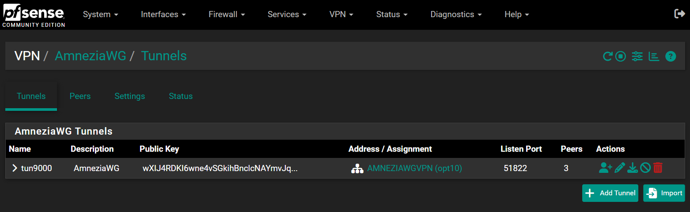
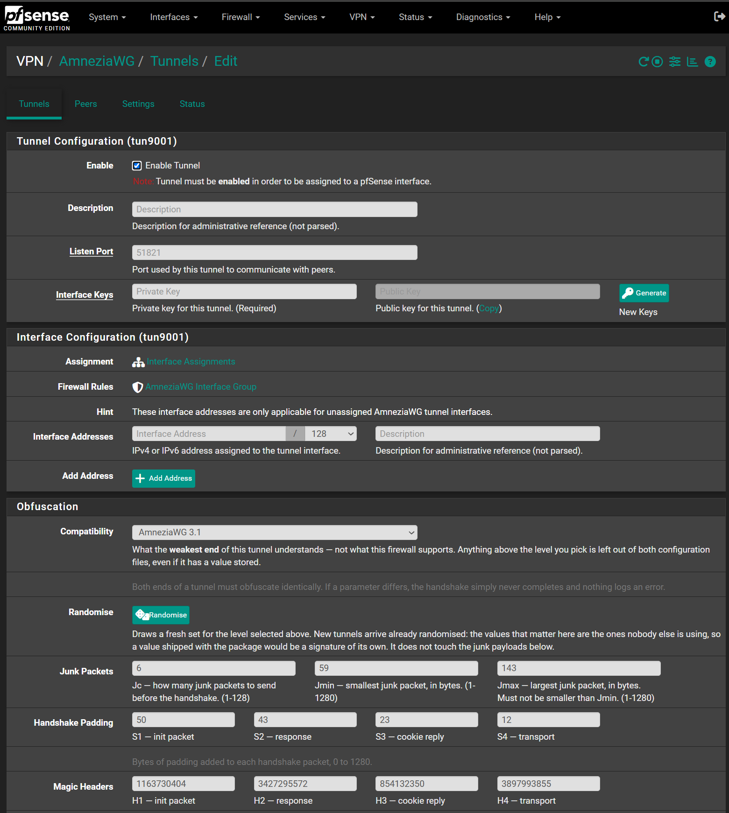
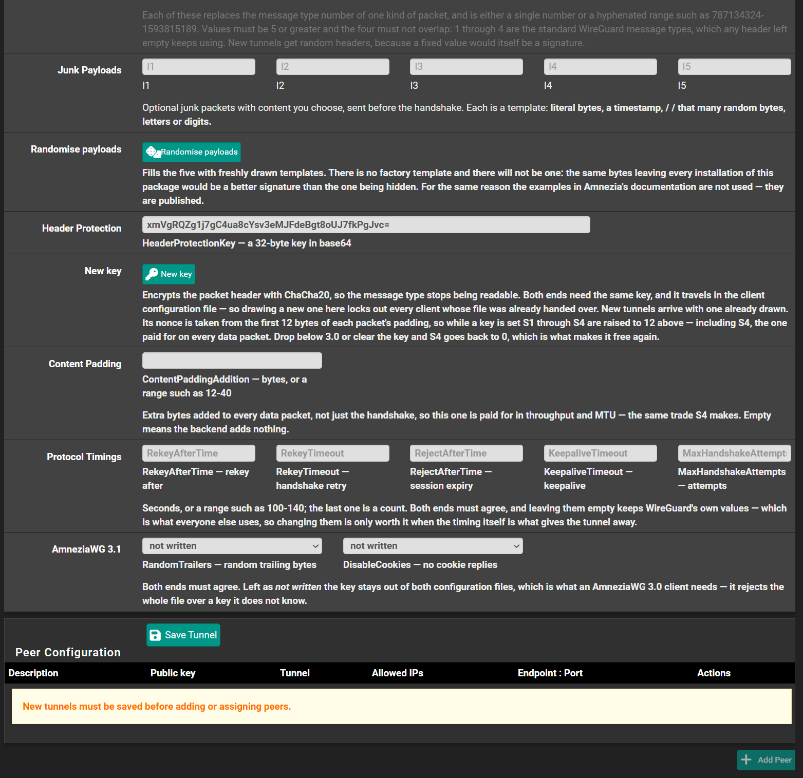
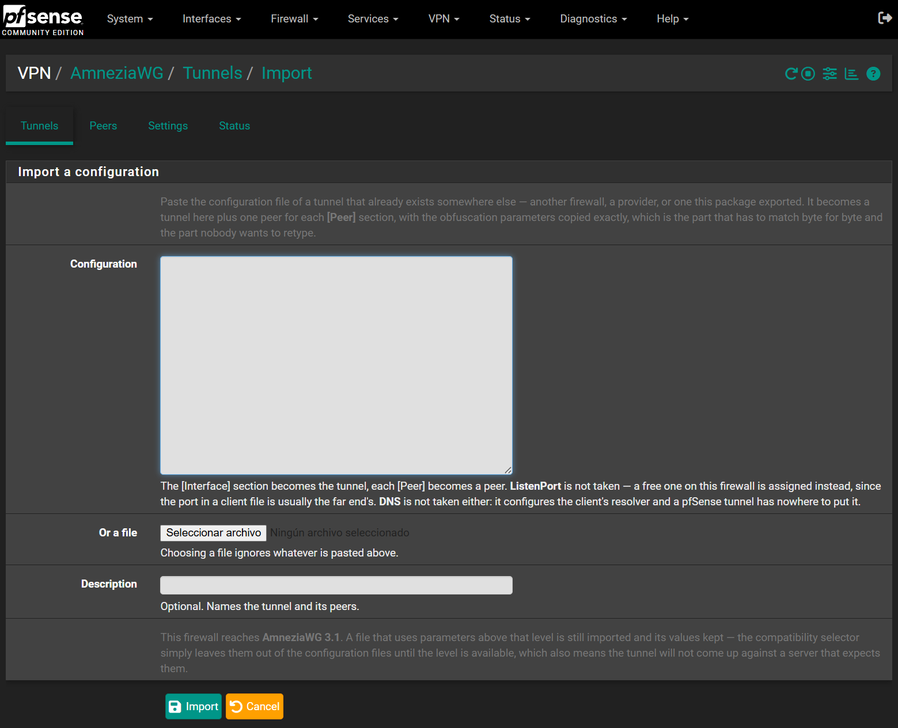
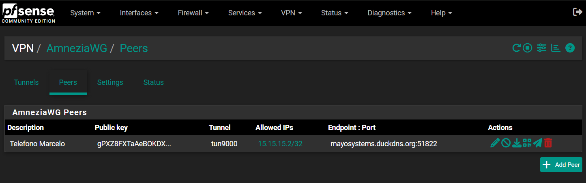
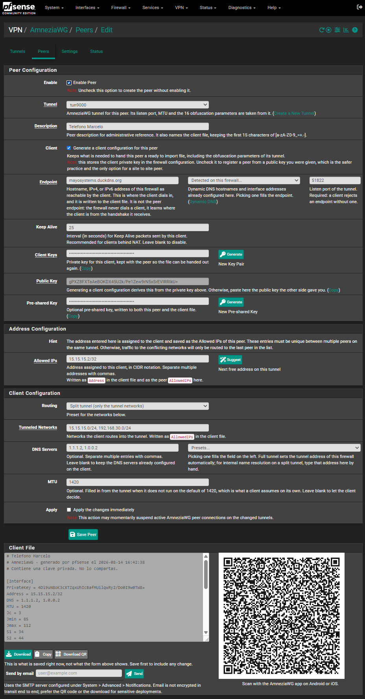
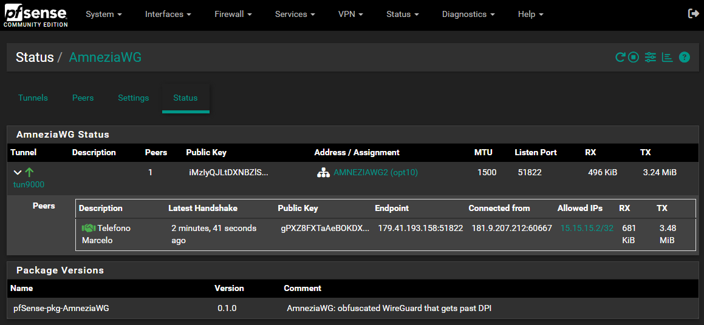
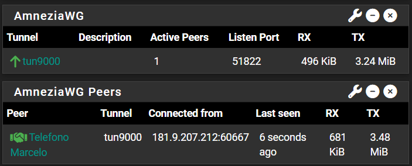

# pfSense-pkg-AmneziaWG

Un paquete de pfSense que agrega **VPN → AmneziaWG**: túneles y peers
gestionados desde la GUI, al nivel del paquete oficial de WireGuard.

[AmneziaWG](https://docs.amnezia.org/documentation/amnezia-wg) es un fork de
WireGuard para evadir DPI. La criptografía es la misma; lo que cambia es la
forma de los paquetes en el cable, para que un DPI no pueda reconocerlos por
firma.

> **Probado sólo en pfSense CE 2.9.0-BETA (FreeBSD 16), amd64**, sobre dos
> firewalls, uno contra el otro. En 2.8.1 y 2.7.x —FreeBSD 15 y 14— el ABI
> `FreeBSD:16:amd64` que declara el `.pkg` hace que `pkg add` lo rechace, así
> que ahí no hay nada que hacer.
>
> **Pero el ABI no alcanza como garantía**, y conviene decirlo claro: FreeBSD 16
> no es sólo 2.9.0. También lo corren pfSense Plus 25.11, 25.11.1, 26.03,
> 26.03.1, 26.07 y 26.10, y en todas ellas `pkg add` acepta este paquete **sin
> una sola advertencia**. Por eso el paquete trae su propia guarda: en una
> versión que no está en la lista de probadas, el instalador **se niega** antes
> de tocar nada, y el servicio se niega a arrancar. Se puede forzar creando
> `/root/.amneziawg-force-install` a mano. El detalle, en [Objetivo](#objetivo).

> **Estado: AmneziaWG 3.1.** El paquete instala, tiene los **25** campos de
> ofuscación —los 16 de 2.0 más los nueve que estrenaron 3.0 y 3.1—, levanta y
> baja túneles desde la GUI supervisando un proceso `amneziawg-go` por túnel,
> tiene watchdog para los que se caen solos, **importa un `.conf` ajeno** para
> conectarse a un túnel que ya existe en otro lado, y entrega la configuración
> del cliente por los tres caminos: descarga, QR y mail. El caudal sobre el
> hardware objetivo está medido: ~830 Mbps, y ofuscar no cuesta rendimiento.
>
> 3.1 está verificado **entre dos pfSense**, por internet: handshake con los 25
> parámetros coincidiendo, protección de headers activa y tráfico cruzando.

## Cómo se ve

Los túneles, con su estado y sus peers:



La sección **Obfuscation**, que es lo que este paquete tiene y ningún otro: el
selector de compatibilidad y los 25 parámetros, sorteados por túnel. Lo de 1.x y
2.0 —paquetes basura, relleno del handshake, magic headers—:



Y lo que estrenaron 3.0 y 3.1, que aparece sólo si el selector llega: la clave de
protección de headers con su botón propio, el relleno de contenido, los cinco
tiempos del protocolo y los dos booleanos:



**Importar** un `.conf` que ya existe en otro lado —otro firewall, un proveedor,
o uno que exportó este mismo paquete— en vez de transcribir 25 valores a mano,
donde un solo dígito mal no da error y deja el handshake sin cerrar para siempre:



La lista de peers, con descargar, QR y mail al lado de editar:



El archivo del cliente vive en la página del peer que lo tiene, con su QR para
escanear desde la app:



El estado de los túneles y el widget del dashboard:





## Estado por fase

| Fase | | Estado |
|---|---|---|
| 1 | Data plane a mano | ✅ validada en 2.9.0-BETA el 13-08-2026 |
| 2 | Esqueleto del paquete | ✅ instalado y verificado en 2.9.0-BETA el 13-08-2026 |
| 3 | Los 16 campos de ofuscación | ✅ verificados de punta a punta el 13-08-2026 |
| 4 | Supervisión de los procesos | ✅ 6 propiedades verificadas el 13-08-2026 |
| 5 | Watchdog | ✅ 20 propiedades verificadas el 13-08-2026 |
| 6 | Configs de cliente: descarga, QR y mail | ✅ 174 tests locales y 61 en el firewall, el 14-08-2026 |

Lo verificado en la fase 2, sobre el firewall: `pkg add` corre `awg_install()`
entero, las dos entradas de menú quedan registradas, las cuatro páginas y el JS
responden 200, los binarios que van adentro del `.pkg` ejecutan en la máquina, y
`pkg delete` borra todo — archivos, menú, grupo de interfaces, servicio— sin
dejar procesos ni interfaces. Lo único que sobrevive a propósito es el bloque de
settings en `config.xml`, porque `keep_conf` viene en `yes`.

Durante esa prueba apareció el bug que tenía el árbol desde el fork: en
`tools/fork-from-wireguard.sh` la regla `s/vpn_wg_/vpn_awg_/g` corría antes que
`s/wg_/awg_/g`, y la segunda volvía a matchear el `wg_` que quedaba adentro del
`awg_` recién escrito. Resultado: ~130 referencias `vpn_aawg_*` y las URLs
todavía apuntando a `/wg/`. Los nombres de archivo estaban bien, así que el
árbol parecía correcto y en realidad ningún link resolvía: el menú habría caído
en 404, o peor, en las páginas del paquete oficial de WireGuard si está
instalado. Está arreglado en el árbol y en el script.

De la fase 3, sobre el firewall: guardar un túnel por el mismo camino que usa
la GUI produce un `.conf` con los 16 parámetros en `[Interface]`, y `awg(8)` lo
parsea (contra un control negativo que sí rechaza). `H1` sobrevive como rango.
La sección Obfuscation renderiza con `H1`–`H4` como texto y `Jc`/`Jmin`/`Jmax`
como número, los headers salen sorteados y distintos en cada túnel nuevo, y la
validación rechaza headers solapados, valores por debajo de 5, `Jmin > Jmax` y
los fuera de rango. Hay 38 tests de la validación en `tools/test-obfuscation.php`.

De la fase 4, seis propiedades medidas sobre el firewall con el mismo harness
antes y después: cada túnel habilitado tiene su proceso, uno deshabilitado no
tiene ninguno, sincronizar un túnel no toca a los otros, un túnel caído vuelve
con un sync, y parar el servicio no deja ni procesos ni interfaces. Por el rc
script —que es lo que corre el earlyshellcmd al boot— `start`, `restart` y
`stop` dan 2/2/1, 2/2/1 y 0/0/0 procesos, interfaces y daemon.

La fase 4 encontró que un hallazgo de la fase 1 valía a medias: matar el
proceso destruye la interfaz **solo con `SIGTERM`**. Con `SIGKILL` quedan
colgados el socket y la interfaz, así que un túnel caído parecía estar vivo.
Está en `docs/arquitectura.md`, sección 11.

De la fase 5: el watchdog es un cron (`VPN → AmneziaWG → Settings`, apagado por
defecto) que revive los túneles cuyo proceso desapareció. La mitad del diseño
es lo que **no** hace: no toca un túnel que vos deshabilitaste ni arranca nada
con el servicio parado. Un túnel que no logra arrancar se reintenta cada vez
más espaciado, hasta una hora, y se olvida en cuanto levanta.

## ¿Cuánto rinde?

Medido sobre el hardware objetivo el 14-08-2026 —un i5-3570 de 4 núcleos— con
`spike/throughput.sh`. Mediana de 3 ventanas de 10 s, caudal de payload puro:

| | Mbps | pps | cores | Mbps/core |
|---|---|---|---|---|
| WireGuard en el kernel | 1483 | 133 155 | 2,38 | 623 |
| AmneziaWG sin ofuscar | 828 | 74 310 | 3,40 | 243 |
| AmneziaWG ofuscado | 835 | 74 985 | 3,41 | 245 |

**Alcanza de sobra**: esos ~830 Mbps son pagando cifrar *y* descifrar en la
misma caja, y un firewall contra clientes remotos paga una sola mitad por
paquete. **La ofuscación es gratis** en caudal —835 contra 828 Mbps es ruido—
porque en AmneziaWG 1.x los paquetes basura y el relleno van en el handshake,
no en los datos. Lo que sí se paga es estar en userspace: 2,5x por core contra
el kernel, que es el precio conocido de que el módulo `if_amn.ko` no cargue en
pfSense.

El detalle, y por qué medir esto tiene tres trampas que solo se ven midiendo,
está en [docs/medicion-throughput.md](docs/medicion-throughput.md).

### Herramientas de verificación

```sh
.tools\php\php.exe tools\test-obfuscation.php   # 77 tests de validación y sorteo
.tools\php\php.exe tools\test-client-conf.php   # 89 tests del .conf del cliente
.tools\php\php.exe tools\test-mail.php          # 61 tests del envío por mail
sh tools/check-calls.sh                         # llamadas a funciones awg_* que no existen
sh tools/check-collisions.sh                    # símbolos globales vs WireGuard
sh tools/check-globals.sh                       # $awgg sin declarar global
```

Los dos últimos existen por bugs que llegaron a un firewall de verdad: uno borró
un cron del sistema (fase 5 en `docs/arquitectura.md`) y el otro tiró un fatal
al guardar un peer. `php -l` no ve ninguno de los dos.

Y hay cinco sondas que corren **sobre el firewall**, contra el paquete
instalado, porque hay cosas que solo se ven ahí:

```sh
scp spike/verify-client-conf.php spike/verify-mail.php spike/verify-peer-save.php \
    spike/verify-version.php spike/verify-autofill.php admin@FIREWALL:/root/
ssh admin@FIREWALL 'php /root/verify-client-conf.php'   # el .conf contra awg(8)
ssh admin@FIREWALL 'php /root/verify-mail.php'          # el mail contra PEAR Mail
ssh admin@FIREWALL 'php /root/verify-peer-save.php'     # el alta de un peer entera
ssh admin@FIREWALL 'php /root/verify-version.php'       # la sonda de version y el filtrado
ssh admin@FIREWALL 'php /root/verify-autofill.php'      # lo sorteado contra un daemon vivo
```

La del mail no manda ningún mensaje: el único envío que intenta va contra
`127.0.0.1:1`, que rechaza la conexión. La de peers escribe `config.xml`, hace
respaldo antes y restaura al salir. La del auto-relleno levanta un daemon de
descarte en `tun9096` —hace falta uno vivo, porque el valor de un `I` lo parsea
el proceso go y no `awg(8)`— y lo baja al terminar.

### La fase 6: las configs de cliente

Generación del `.conf` del cliente con QR, zip y mail, incluyendo los parámetros
de ofuscación. Es la pieza que ninguna de las referencias tiene y la que hace
usable el modo servidor. Va **dentro de la página de peers que ya existe**, no en
un módulo aparte: wgeasy tiene que atornillarse por afuera porque no puede tocar
el paquete oficial de WireGuard, pero acá la página de peer es propia.

La página de peers quedó al nivel de la de wgeasy:
mismos campos y mismas ayudas, el par de claves generado desde la página, la
próxima dirección libre a un botón, y **todo lo que sale del túnel elegido
—puerto, MTU, DNS, redes y los 16 parámetros de ofuscación— tomado del túnel**,
no cargado a mano. Cambiar el túnel en el desplegable recalcula los valores sin
volver al servidor.

Tiene dos modos. Con *Generate a client configuration* tildado, el firewall arma
el cliente entero y guarda su clave privada para poder volver a exportarlo; la
clave pública del peer se **deriva** de la privada, porque cargarlas por
separado y que no se correspondan da un cliente que no conecta y nada lo avisa.
Destildado, es la página de peer de siempre: se pega una clave pública y no se
guarda nada del otro lado, que es el caso site-to-site y el del cliente que
genera sus propias claves —la práctica más segura—.

La ofuscación del cliente sale de `awg_obfuscation_pairs()`, la misma función
que escribe el `.conf` del servidor: los dos extremos tienen que ofuscar
idéntico o no hay handshake, y dos copias del mismo bucle se desincronizan sin
que falle nada hasta que un cliente no conecta.

El endpoint no hay que escribirlo: el desplegable ofrece lo que el firewall ya
sabe de sí mismo —los hostnames de DNS dinámico primero, porque sobreviven a un
cambio de dirección de la WAN, con la IP que tienen registrada; después las
direcciones de cada interfaz, avisando cuáles son privadas y necesitan un port
forward; y el FQDN del sistema—. Los DNS y los alias del firewall también se
ofrecen como presets; de un alias se copia su **contenido**, porque AmneziaWG no
resuelve nombres y lo que viaja al cliente tienen que ser las direcciones.

Guardar un peer con cliente vuelve a su propia página, donde abajo está el
archivo con su **QR** para escanear con la app, el botón de copiar y el de
descargar. Queda ahí para siempre, no solo en el momento de crearlo: el teléfono
no siempre está a mano cuando uno da de alta el peer, y volver a buscarlo no
debería obligar a re-clavear al cliente.

La app de Android es **AmneziaWG**
([amneziawg-android](https://github.com/amnezia-vpn/amneziawg-android), en Google
Play), que importa un `.conf` común o su QR. La app oficial de WireGuard **no
sirve**: no conoce `Jc`, `S1` ni `H1`. Y ojo con no confundirla con AmneziaVPN,
la app multiprotocolo, que comparte configuraciones en un formato codificado
propio. Un detalle del que ya estamos a salvo: la app de Android falla al
importar si el archivo trae campos `I2`–`I5` **vacíos**, y `awg_obfuscation_pairs()`
nunca escribe un campo vacío.

Y hay un **widget de peers** para el dashboard, aparte del que vino del fork:
ese lista un renglón por túnel, y este uno por peer —quién está conectado, desde
dónde y cuándo se lo vio— con umbral de actividad configurable y la opción de
mostrar también los desconectados.

Verificado en los dos lados: 89 tests de lógica en `tools/test-client-conf.php`,
y 36 contra el firewall con `spike/verify-client-conf.php`, que comprueba que
`awg(8)` parsee el archivo generado —con control negativo—, que todo lo que se
calcula del túnel aguante una instalación sin ningún túnel, y que lo detectado
sea realmente discable.

En la lista de peers, cada peer exportable tiene además los iconos de
**descargar**, **QR** y **mail** al lado de editar. La descarga va comprimida:
todo cliente acepta un archivo, y un `.zip` sobrevive a que lo pasen por mail o
por un mensajero, cosa que un `.conf` pelado muchas veces no.

### El envío por mail, y lo que apareció al medirlo

El tercer camino de salida del mismo archivo. Usa el SMTP que el firewall ya
tiene configurado en *System → Advanced → Notifications*: un paquete de VPN no
tiene por qué pedir de nuevo un servidor de correo, ni guardar una segunda copia
de esa contraseña. Se manda el **mismo `.zip`** que entrega la descarga, para que
sea el mismo archivo por los dos caminos.

El camino obvio —y el que usa wgeasy— es PHPMailer, que adjunta solo. Medido
sobre 2.9.0-BETA con `spike/verify-mail.php`: **PHPMailer no existe en pfSense**.
No está la clase, no está el archivo, no está en ningún lado. Lo que hay es
**PEAR Mail**, que es lo que usa el propio `send_smtp_message()` del sistema. Un
camino que no puede correr no es un respaldo, así que el adjunto se arma
construyendo el MIME a mano sobre PEAR Mail. Sin esa medición el adjunto no
habría funcionado nunca y el síntoma habría sido "siempre llega pegado en el
cuerpo", sin ningún error.

Quedan dos caminos igual, y el segundo existe por una razón distinta de la que
parece: el respaldo —`send_smtp_message()`, que pega el archivo en el cuerpo— no
cubre que el servidor esté caído, porque si lo está fallan los dos. Cubre que el
MIME que armamos nosotros esté mal, que es lo único que ese camino no comparte.

Leer la configuración de pfSense tiene tres trampas, y las tres están mal en
wgeasy —de donde salió este código—:

| se lee | lo que hay de verdad | qué pasa si se lee mal |
|---|---|---|
| `authentication_mech` | `authentication_mechanism` | se manda sin autenticar y el servidor rechaza |
| `isset(ssl_validate)` | `sslvalidate` = `enabled`/`disabled` | la validación del certificado queda siempre apagada |
| `tls` | no existe, la página solo ofrece SSL | rama muerta |

Y una cuarta en el respaldo: `send_smtp_message()` devuelve **null si salió bien
y la cadena del error si falló**, así que el `!== false` de wgeasy informa como
éxito un envío que falló. Además se planta sin hacer nada si las notificaciones
están deshabilitadas, salvo que se la fuerce — acá se la fuerza, porque esto no
es una notificación automática sino alguien que apretó *Send*.

Verificado con 61 tests locales en `tools/test-mail.php` —incluido que el binario
del adjunto vuelva idéntico del base64, que ninguna línea pase de 76 caracteres y
que por el cuerpo viaje el `.conf` en texto y nunca el zip— y 25 contra el
firewall con `spike/verify-mail.php`, que además prueba el error de un servidor
que no contesta contra PEAR de verdad, sin mandar ningún mensaje.

### El selector de versión

Los 16 campos no van todos juntos: `S3`, `S4` e `I1`–`I5` los estrenó AmneziaWG
2.0. Equivocarse no es un error suave —`awg(8)` aborta el `.conf` entero ante una
clave que no conoce, y la app de Android rechaza el archivo completo con
`UNKNOWN_ATTRIBUTE`—, así que el túnel simplemente no levanta y nada lo explica.

Por eso el túnel tiene un selector de **compatibilidad**, y la pregunta que hace
no es "qué versión tengo" sino **qué entiende el extremo más débil de este
túnel**. Se puede elegir menos de lo que soporta el firewall, porque el otro
extremo puede ser más viejo. Y hoy eso es literal: el soporte de 3.x **está
escrito y sin publicar** en los clientes — el de Windows tiene 3.1 en su master
y su última release es la 2.0.2, anterior a esos commits. La app que se instala
hoy rechaza un `.conf` de 3.0.

Lo que **no** se ofrece se dice y se explica por qué, con las dos razones
separadas: hasta dónde llega el `awg` que va adentro del `.pkg` —detectado con
una sonda, no preguntado— y hasta dónde sabe escribir este paquete. Hoy las dos
dan **3.1**.

La decisión vive en `awg_obfuscation_pairs()`, no en la pantalla. Es la
diferencia entre que ande y que parezca que anda: los campos escondidos se
siguen guardando a propósito —para no borrarle al usuario valores que no vio— así
que si el filtro viviera en la GUI, bajar un túnel de 2.0 a 1.x seguiría
escribiendo su `S3` en los dos archivos mientras la pantalla dice 1.x.

Verificado con 113 tests locales de validación, 96 del `.conf` del cliente, 54
del importador y 14 más sobre el firewall (`spike/verify-version.php`), que
incluyen el control negativo de la sonda y que los `.conf` de los cuatro niveles
los parsee `awg(8)`.

### Todo se sortea, y por qué eso no es un detalle

Un túnel nuevo llega con **todos** los parámetros sorteados, no solo los
headers: `Jc`, `Jmin`, `Jmax`, `S1`, `S2` y —si el nivel llega— `S3`. Antes eran
constantes razonables, y el problema no era que fueran malas sino que **eran las
mismas en todas las instalaciones**: lo que un DPI reconoce no es el valor sino
que se repita. Un paquete que se instala en mil firewalls con `Jc = 4` y
`S1 = 30` le está regalando una firma nueva a cambio de borrar la vieja.

`S4` es la excepción y queda en **cero**: es el único parámetro que se paga por
paquete de datos —el relleno entra en el camino de transporte, no en el
handshake— y además come MTU. Prenderlo tiene que ser una decisión.

Los `I1`–`I5` tienen su propio botón, porque son opcionales. Cada uno es una
plantilla —`<b hex>` bytes literales, `<t>` un timestamp, `<r N>`/`<rc N>`/`<rd N>`
esa cantidad de bytes, letras o dígitos al azar— y el generador arma una
distinta cada vez, empezando siempre por bytes literales propios. **No hay
plantilla de fábrica y no la va a haber**, por lo mismo de arriba; el ejemplo
que publica la documentación de Amnezia es justamente el único que no se puede
usar, porque está publicado.

Esos campos ahora se validan: hasta acá eran texto libre, y un error de tipeo
dejaba el túnel sin levantar sin decir nada. Las reglas salen de
`newObfChain()` y sus constructores en `device/obf.go`, no de la documentación.
En tres cosas somos **más estrictos que el backend**, a propósito: un largo
negativo (que él acepta y después revienta el proceso), uno que no entra en un
paquete UDP, y el texto suelto fuera de las etiquetas (que él ignora en
silencio, así que lo que ves en la pantalla no sería lo que viaja).

Verificado con 77 tests locales y 9 contra un daemon vivo en el firewall
(`spike/verify-autofill.php`): que el backend acepte los 25 juegos y las 40
plantillas sorteadas, y —la propiedad que importa— que nuestro validador
**nunca apruebe algo que el backend rechace**.

### Rotación de puertos

La ofuscación disfraza el **contenido** de los paquetes. No disfraza que una
máquina sostenga una conversación UDP con la misma IP y el mismo puerto durante
horas, y ese patrón se reconoce sin leer nada. Algunos ISP lo estrangulan: la
documentación de Hysteria lo dice de frente —*"users in China often report that
their ISPs block/restrict persistent UDP connections to a single port"*— y por
eso su cliente salta de puerto cada 10 segundos.

Son **dos capas distintas**, y hasta ahora este paquete sólo cubría la primera.

El peer que disca puede ahora rotar el puerto de destino dentro de un rango.
Cada tramo le parece un flujo nuevo a quien esté mirando la conexión. Por debajo
es una sola cosa: `awg set <túnel> peer <clave> endpoint <host>:<puerto>` cada N
segundos, con el reloj propio del demonio —separado del de DNS, porque saltar
cada 10 segundos no es motivo para consultar DNS cada 10 segundos.

**Rota sólo el puerto de destino, y eso es deliberado.** El de origen queda fijo,
así que el otro extremo sigue viendo al peer llegar del mismo lugar de siempre y
**nunca dispara su roaming** —que si se disparara, devolvería el endpoint al
puerto anterior y desharía la rotación. Rotar también el origen obligaría a
rebindear el socket, que es justo el que lleva el parche de sticky sockets.

El otro extremo **no necesita este paquete ni saber que estamos rotando**: le
alcanza una regla de NAT que mande el rango a su puerto de escucha. Es el mismo
truco que Hysteria documenta para su propio servidor. Conviene hacerla desde la
GUI y no a mano: la regla generada lleva `reply-to`, y sin eso un firewall
multi-WAN contesta por la interfaz equivocada y el túnel se muere sin decir nada
—medido, no supuesto.

Lo que está probado es que **rota sin costar un paquete**: entre dos firewalls
por internet, con AmneziaWG 3.1 y `S4` puesto, 8 saltos en 75 segundos con 75 de
75 paquetes y sin un solo rehandshake. Y a 2 segundos también.

Lo que **no** está probado —y no lo podemos probar desde acá— es que sirva contra
un censor concreto. Rotar y que eso destrabe un bloqueo son dos afirmaciones
distintas, y sólo la primera está medida. El detalle en
[docs/port-hopping.md](docs/port-hopping.md).

### Próximo paso concreto

Publicado, con las
[releases en GitHub](https://github.com/MarceloMayo74/pfsense-amneziawg/releases)
y la fuente del `awg` adjunta (ver [docs/licencias.md](docs/licencias.md)).

Lo que sigue no depende de escribir código sino de que alguien lo use:

- **Si la rotación de puertos sirve.** Que rota sin costar un paquete está
  medido; que destrabe un bloqueo sólo lo puede decir alguien que esté detrás de
  uno. Ver [docs/port-hopping.md](docs/port-hopping.md).
- **El importador parcial de parámetros.** Pedido en el foro, pero "importar
  algunos parámetros" admite al menos tres lecturas distintas y construir la
  equivocada es tirar el trabajo. Falta que quien lo pidió elija cuál.

## Por dónde empezar

Leé **[docs/arquitectura.md](docs/arquitectura.md)**. Tiene las decisiones
tomadas, el porqué de cada una, y el orden de implementación en seis fases.

El historial de git es parte de la documentación: cada commit explica qué
cambió y por qué, no solo qué archivos se tocaron.

Lo que ya está resuelto ahí:

- **Userspace, no kernel.** El módulo `if_amn.ko` de los ports de FreeBSD no
  carga en pfSense y nunca va a cargar de forma confiable — se publica pineado a
  un `__FreeBSD_version` exacto. Se usa `amneziawg-go`, con un parche propio
  (ver abajo).
- **Sticky sockets, para que ande con doble WAN.** `amneziawg-go` hereda de
  `wireguard-go` una limitación que solo se nota en firewalls multi-WAN: no
  responde desde la dirección por la que le hablaron, así que un cliente que
  disca a una WAN que no tiene el default gateway nunca completa el handshake
  —y no hay ni un error en ningún log—. El módulo de kernel de WireGuard no
  tiene el problema porque vive adentro de la pila de red. Está portado a
  FreeBSD en `patches/amneziawg-go/`, medido y con tests que corren sobre el
  firewall: [docs/plan-sticky-freebsd.md](docs/plan-sticky-freebsd.md).
- **Interfaces `tun9000`–`tun9999`.** Es lo que hace que pfSense las liste en
  Interfaces → Assignments sin parchear la base.
- **Los 25 parámetros de ofuscación** con sus rangos y validaciones, incluida la
  trampa de que `H1`–`H4` son texto con rangos, no enteros.
- **AmneziaWG 2.0** (`S3`, `S4`, `I1`–`I5`): qué agrega, cuáles tienen que
  coincidir en los dos extremos y cuáles no, la mini-gramática de los `I` y por
  qué `S4` es el único que cuesta caudal — todo medido contra el backend en
  [docs/amneziawg-2.0.md](docs/amneziawg-2.0.md).
- **AmneziaWG 3.0 y 3.1**: qué agrega cada clave, por qué la protección de
  headers obliga a pagar `S4`, cuáles tienen que coincidir en los dos extremos y
  por qué bajar de nivel obliga a rehacer el proceso —
  [docs/amneziawg-3.0.md](docs/amneziawg-3.0.md).
- **Un `.pkg` por ABI**, porque lleva binarios adentro. Hoy se compila uno solo:
  `FreeBSD:16:amd64`, que es 2.9.0.

## Estructura

```
docs/arquitectura.md      el documento de diseño
src/                      el árbol del paquete, tal como se instala
build/make-pkg.ps1        arma el .pkg
spike/                    sondas contra el firewall
tools/                    utilidades de desarrollo
reference/                código de terceros, no versionado
bin/                      binarios por ABI, no versionado
```

`reference/` está en el `.gitignore` porque es código de otros autores. Para
recuperarlo en un clon nuevo:

```sh
sh tools/fetch-references.sh
```

## Compilar el paquete

El paquete lleva adentro `amneziawg-go` y `awg`, así que hay un `.pkg` por ABI.
Se compila el de 2.9.0 nada más.

```powershell
powershell -ExecutionPolicy Bypass -File build\make-pkg.ps1 -Abi FreeBSD:16:amd64
```

El script busca los binarios en `bin/<ABI>/` y solo intenta descargarlos si no
están. Si la máquina de build no llega a `pkg.freebsd.org`, se traen desde un
firewall que corra ese ABI — que por definición sí llega:

```sh
# en el pfSense
sh /root/fetch-binaries.sh
```
```powershell
# de vuelta acá
scp root@FIREWALL:/root/awg-bin-FreeBSD:16:amd64.tar.gz .
tar -xzf awg-bin-FreeBSD:16:amd64.tar.gz -C bin\FreeBSD-16-amd64\
```

Instalar:

```sh
pkg add /root/pfSense-pkg-AmneziaWG-1.2.0-FreeBSD-16-amd64.pkg
```

## Objetivo

**pfSense CE 2.9.0-BETA (FreeBSD 16), amd64.**

2.8.1 (FreeBSD 15) queda fuera a propósito. Sostener un ABI que no se puede
probar es peor que no sostenerlo: se publica algo que nadie verificó. Todo lo de
este paquete está medido sobre una 2.9.0, y 2.8.1 es la versión que se va.

### La guarda de versión, y por qué hace falta

El ABI del `.pkg` **no** es un control de versión de pfSense. `FreeBSD:16:amd64`
lo cumple 2.9.0 CE y lo cumplen seis releases de pfSense Plus. `pkg add` las
acepta a todas, en silencio, y el paquete se cablea al arranque del firewall
—`earlyshellcmd`, grupo de interfaces, ACL de Unbound, cron del watchdog— de un
sistema que nadie probó. El primer síntoma, si llega, llega después y lejos.

Por eso la lista de versiones probadas vive en el paquete, en
`supported_versions` de `awg_globals.inc`, y se comparan como prefijo:

| Dónde | Qué hace |
|---|---|
| `awg_install()` | se niega **antes** de escribir en `config.xml`; los archivos quedan en disco pero inertes, y `pkg delete` no deja rastro |
| `awg_service_cli_start()` | se niega a arrancar, y lo dice en el log del sistema |

La salida de emergencia es un archivo que hay que crear a mano desde la shell:

```
touch /root/.amneziawg-force-install
```

El que llega ahí sabe lo que hace. Nadie llega por accidente.

**Agregar una versión a la lista es decir "la probé".** No se agrega por
parecido, aunque el commit de FreeBSD sea el mismo.

## Relación con wgeasy

Este proyecto es hermano de
[pfsense-wgeasy](https://github.com/marcelomayo/pfsense-wgeasy), que hace lo
mismo para WireGuard: generar la configuración del cliente con QR, descarga y
envío por mail. La fase 6 del plan integra esa funcionalidad acá.

## Licencia

**Apache 2.0.** El árbol salió de `pfSense-pkg-WireGuard`, que es Apache 2.0, y
cada archivo heredado conserva su encabezado: elegir otra cosa habría dado un
árbol mezclado. Es además la licencia de los paquetes de pfSense y la del
proyecto hermano.

Adentro del `.pkg` viajan dos binarios que siguen siendo de sus autores: `awg`
es **GPLv2** y `amneziawg-go` es **MIT**. Son programas aparte que el paquete
ejecuta —no se linkea nada—, así que distribuirlos en el mismo archivo es
agregación y no cambia la licencia de lo demás. Lo que la GPL sí obliga, y está
hecho: su texto viaja adentro del paquete, y **cada release lleva adjunta la
fuente exacta del `awg` que distribuye** — el tarball del tag del que se
compiló, con su `SHA256` y el `BUILDINFO` de la máquina que lo compiló, que deja
[`tools/build-awg-freebsd.sh`](tools/build-awg-freebsd.sh).

Desde 3.x ese binario lo compilamos nosotros y no sale del port de FreeBSD, que
sigue en 2.0. Lleva **una** modificación, declarada en el `NOTICE`: deja afuera
el camino de IPC por kernel, que no compila en 3.x y que en pfSense no se usa.

Qué cubre a qué, pieza por pieza: [NOTICE](NOTICE). El porqué de la elección, la
cadena verificada del binario a su fuente y el checklist de cada release:
[docs/licencias.md](docs/licencias.md).
