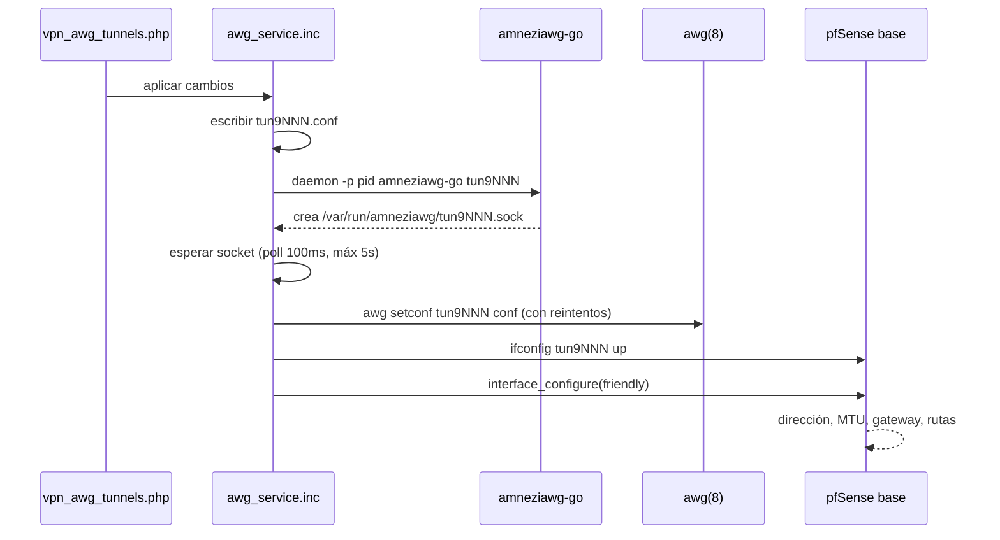

# pfSense-pkg-AmneziaWG — Arquitectura

Documento de diseño para un paquete de pfSense que agrega **VPN → AmneziaWG**,
con gestión de túneles y peers desde la GUI, al nivel del paquete oficial de
WireGuard.

Estado: diseño cerrado, sin implementar. Las decisiones de acá salen de un
spike hecho contra pfSense 2.9.0-BETA el 13-08-2026 y del estudio de tres
implementaciones existentes.

---

## 1. Qué es AmneziaWG y qué cambia

AmneziaWG es un fork de WireGuard para evadir DPI. La criptografía es la misma;
lo que cambia es la forma de los paquetes en el cable.

WireGuard es trivial de fingerprintear: el handshake initiation siempre mide
148 bytes y arranca con `0x01`, el response siempre 92 bytes con `0x02`. Un DPI
lo detecta y lo descarta sin mirar el contenido. AmneziaWG agrega paquetes
basura, relleno de tamaño variable y headers arbitrarios para romper esa firma.

Para la GUI esto significa **16 campos nuevos, todos a nivel `[Interface]`**.
Ninguno es por peer — verificado en `config.c` de `amneziawg-tools`. La página
de peers no se toca.

---

## 2. Decisión de arquitectura: userspace

Hay dos formas de implementar el data plane. Se eligió userspace.

### Lo que se descartó: módulo de kernel

Existe `net/amnezia-kmod` en los ports de FreeBSD (`if_amn.ko`, v2.0.11,
mantenedor vova@zote.me). Es el driver `if_wg` de FreeBSD con cambios mínimos.
Se probó cargarlo en pfSense 2.9.0-BETA:

```
KLD if_amn.ko: depends on kernel - not available or version mismatch
```

El módulo está compilado para `__FreeBSD_version` **1600019**; el kernel de la
caja es **1600018**. Una versión de diferencia y no carga.

El punto no es esa caja puntual. Los kmod se publican pineados a un
`__FreeBSD_version` exacto, y pfSense corre kernels propios de Netgate que no
van a coincidir con los del builder de FreeBSD salvo por casualidad. Aunque
cargara hoy, se rompería en cada actualización de pfSense. Para un paquete
distribuible habría que publicar un `.ko` por cada build de pfSense.

**Descartado por diseño, no por mala suerte.**

### Lo elegido: `amneziawg-go`

Implementación userspace en Go. Crea una interfaz TUN y habla el protocolo
desde userland. Ventajas decisivas acá:

- No depende de ABI de kernel. Sobrevive a las actualizaciones de pfSense.
- Está empaquetado en los ports de FreeBSD (`amneziawg-go-0.2.16_7`) para
  **FreeBSD 15 y 16**, o sea para las dos versiones de pfSense objetivo.
  No hace falta compilar nada ni instalar Go.
- Arquitectura ya probada en producción sobre pfSense 2.8.1 por
  `qtronixx/pfSense-pkg-amneziawg-client`.

El costo es performance: la criptografía corre en userspace, sin fast path de
kernel. Para un túnel anti-DPI sobre internet el cuello de botella es el enlace
WAN, no el CPU.

---

## 3. Componentes y procedencia

| Componente | De dónde sale | Licencia |
|---|---|---|
| `amneziawg-go` | paquete oficial FreeBSD, por ABI | MIT |
| `awg` / `awg-quick` | `amnezia-tools`, paquete oficial FreeBSD | GPLv2 |
| Modelo de servidor, peers, GUI | fork de `pfSense-pkg-WireGuard` | Apache 2.0 |
| Plomería del proceso userspace | `qtronixx/pfSense-pkg-amneziawg-client` | MIT |
| Spec de validación de los 16 campos | `MrTheory/os-amneziawg` (OPNsense) | — |
| Generador de configs de cliente | `wgeasy`, propio | — |

Sobre GPLv2: si se redistribuye el binario `awg` dentro del `.pkg`, hay que
ofrecer el código fuente. `amneziawg-go` es MIT, sin fricción.

---

## 4. Estructura del paquete

Espejo de `pfSense-pkg-WireGuard`, con el prefijo `awg` en lugar de `wg`.

```
/usr/local/pkg/amneziawg.xml                    registro de menú y servicio
/usr/local/pkg/amneziawg/
    classes/awgconfig.class.php                 modelo de configuración
    includes/awg.inc                            entrada, resync
            awg_api.inc                         creación/destrucción de interfaz
            awg_globals.inc                     constantes, rutas, defaults
            awg_guiconfig.inc                   helpers de GUI
            awg_install.inc                     hooks de install/deinstall
            awg_service.inc                     supervisor de procesos go
            awg_validate.inc                    validación de los 16 campos
/usr/local/www/awg/
    vpn_awg_tunnels.php                         lista de túneles
    vpn_awg_tunnels_edit.php                    edición + sección Obfuscation
    vpn_awg_peers.php                           lista de peers
    vpn_awg_peers_edit.php                      edición de peer
    vpn_awg_settings.php                        ajustes del paquete
    status_amneziawg.php                        estado
/usr/local/bin/amneziawg-go                     binario, por ABI
/usr/local/bin/awg                              binario, por ABI
/usr/local/etc/rc.d/amneziawgd                  rc script
/etc/inc/priv/amneziawg.priv.inc                privilegios
/usr/local/www/widgets/                         widget de dashboard
```

El menú se registra con cinco líneas en el XML; pfSense lo levanta solo:

```xml
<menu>
    <name>AmneziaWG</name>
    <section>VPN</section>
    <url>/awg/vpn_awg_tunnels.php</url>
</menu>
```

---

## 5. Nombres de interfaz

**`tun9000`–`tun9999`.**

Esta es la decisión menos obvia del diseño y la que evita un problema serio.
pfSense reconoce las interfaces `tunN` como asignables en
Interfaces → Assignments sin necesidad de parchear nada de la base. Un nombre
inventado tipo `tun_awg0` no aparecería en la lista de asignación.

Es la solución que usa `pfSense-pkg-amneziawg-client`, validada en producción.
El rango alto evita colisionar con túneles de OpenVPN.

---

## 6. Ciclo de vida de un túnel



Tres detalles que salieron de leer `awg_up()` y que no son obvios:

1. **`daemon(8)` sin el flag `-f`.** `-f` redirige stdio del hijo a `/dev/null`
   — no significa "forkear". Con `-f` se pierden todos los logs y crashes de
   `amneziawg-go`. El autor del paquete de referencia lo documentó después de
   perder tiempo debuggeando con archivos de log vacíos.

2. **Hay que esperar el socket UAPI antes de `setconf`.** El proceso Go tarda
   en crear `/var/run/amneziawg/tun9NNN.sock`. Sin la espera, `setconf` falla.

3. **Dirección, MTU y gateway los pone pfSense, no el paquete.** Se llama a
   `interface_configure()` con el nombre amigable de la interfaz asignada.
   Única fuente de verdad, y así el resto del firewall (reglas, NAT, DNS) ve el
   túnel como cualquier otra interfaz.

`awg` habla con el proceso userspace y no con el kernel: `ipc.c` chequea
`userspace_has_wireguard_interface()` antes de caer al camino de kernel, y
`amneziawg-go` y `amneziawg-tools` coinciden en `/var/run/amneziawg`.

---

## 7. Modelo de datos: los 16 campos

Todos a nivel `[Interface]`. Rangos tomados del `Instance.xml` de OPNsense.

| Campo | Tipo | Rango | Significado |
|---|---|---|---|
| `Jc` | int | 1–128 | cantidad de paquetes basura antes del handshake |
| `Jmin` | int | 1–1280 | tamaño mínimo de esos paquetes |
| `Jmax` | int | 1–1280 | tamaño máximo |
| `S1` | int | 0–1280 | relleno del paquete init |
| `S2` | int | 0–1280 | relleno del response |
| `S3` | int | 0–1280 | relleno del cookie reply — **AWG 2.0** |
| `S4` | int | 0–1280 | relleno del transport — **AWG 2.0** |
| `H1`–`H4` | **texto** | `/^\d{1,10}(-\d{1,10})?$/` | headers mágicos, 5–4294967295 |
| `I1`–`I5` | texto | libre | paquetes junk con contenido propio — **AWG 2.0** |

**Trampa: `H1`–`H4` no son enteros.** Aceptan rangos con guión
(`787134324-1593815189`). Si se modelan como `Form_Input` numérico se rompe
silenciosamente con configs reales.

**Versionado del protocolo.** `S3`, `S4`, los rangos en `H` y los `I1`–`I5` son
AWG 2.0. Contra un backend 1.x esos campos no deben escribirse en el `.conf`.
La GUI tiene que saber contra qué versión de backend corre.

Ejemplo de `.conf` generado:

```ini
[Interface]
PrivateKey = ...
ListenPort = 51820
Jc = 5
Jmin = 10
Jmax = 50
S1 = 34
S2 = 134
H1 = 787134324-1593815189

[Peer]
PublicKey = ...
AllowedIPs = 10.8.1.14/32
```

---

## 8. Convivencia con pfSense-pkg-WireGuard

El objetivo es que ambos paquetes puedan estar instalados a la vez. Puntos de
colisión a revisar:

| Recurso | WireGuard | AmneziaWG |
|---|---|---|
| Socket UAPI | `/var/run/wireguard` | `/var/run/amneziawg` ✓ ya distinto |
| Prefijo de interfaz | `tun_wg` | `tun9NNN` ✓ ya distinto |
| Interface group | `WireGuard` | `AmneziaWG` |
| Alias de puertos | `WireGuardListenPorts` | `AmneziaWGListenPorts` |
| ACL de Unbound | `WireGuard` | `AmneziaWG` |
| Servicio | `wireguardd` | `amneziawgd` |
| Rama de config XML | `installedpackages/wireguard` | `installedpackages/amneziawg` |
| Entradas de menú | VPN/Status → WireGuard | VPN/Status → AmneziaWG |

Los dos primeros ya están resueltos por las decisiones de arquitectura. El
resto es renombrado disciplinado en `awg_globals.inc`, donde toda la identidad
del paquete está centralizada.

---

## 9. Build y distribución

**Un `.pkg` por ABI.** Los binarios embebidos no son intercambiables entre
FreeBSD 15 y 16:

| pfSense | FreeBSD | ABI |
|---|---|---|
| 2.8.1 | 15 | `FreeBSD:15:amd64` |
| 2.9.0-BETA | 16.0-CURRENT | `FreeBSD:16:amd64` |

El `make-pkg.ps1` necesita un paso previo que resuelva y descargue los binarios
del ABI correspondiente. **No se puede adivinar el nombre de archivo**: el repo
publica bajo `All/Hashed/` con sufijo de hash, y los kmod además llevan la
versión de FreeBSD embebida:

```
All/Hashed/amneziawg-go-0.2.16_7~2$fecr5ea7.pkg
```

La única fuente confiable es el catálogo del repo. Tampoco sirve listar `/All/`
— `pkg.freebsd.org` responde `Forbidden`, no hay autoindex.

```sh
fetch -qo - https://pkg.freebsd.org/${ABI}/latest/packagesite.pkg \
  | tar -xOf - packagesite.yaml \
  | grep '"name":"amneziawg-go",' \
  | grep -oE '"repopath":"[^"]*"'
```

---

## 10. Orden de implementación

Cada fase deja algo verificable. No se pasa a la siguiente sin que la anterior
funcione en el firewall.

**Fase 1 — Data plane a mano.** Sin GUI. Bajar los binarios, escribir un
`.conf` a mano, levantar un túnel con `daemon` + `awg setconf`, asignarlo en
Interfaces → Assignments y que pase tráfico. Valida el supuesto central antes
de escribir PHP.

**Fase 2 — Esqueleto del paquete.** Fork de `wireguard-nativo` con el
renombrado completo. Que instale, aparezca en el menú, y no rompa nada. Sin
funcionalidad de ofuscación todavía.

**Fase 3 — Los 16 campos.** Sección Obfuscation en `vpn_awg_tunnels_edit.php`,
validadores en `awg_validate.inc`, serialización al `.conf`. Acá entra la
trampa de `H1`–`H4` como texto.

**Fase 4 — Supervisión.** `awg_service.inc` como supervisor de N procesos go:
arranque al boot, parada ordenada, reinicio de un túnel sin tocar los otros.

**Fase 5 — Watchdog.** Detección de túnel caído y relevantamiento, por cron.
Ni el paquete oficial de WireGuard ni el de referencia lo tienen; el plugin de
OPNsense sí, y vale robarle la idea.

**Fase 6 — Integración con wgeasy.** Generación de configs de cliente con QR,
zip y mail, incluyendo los parámetros de ofuscación. Es la pieza que ninguna de
las referencias tiene y la que hace usable el modo servidor.

---

## 11. Riesgos abiertos

- **Performance real de `amneziawg-go`** en el hardware objetivo. No medido.
  Se asume suficiente para enlaces WAN típicos, pero conviene medirlo en la
  fase 1 antes de comprometerse.
- **Estabilidad de los procesos go a largo plazo.** El watchdog de la fase 5
  existe justamente porque el plugin de OPNsense consideró necesario tenerlo.
- **Detección de versión del backend** (AWG 1.x vs 2.0) para decidir qué campos
  escribir. Sin resolver: hay que ver si `awg --version` alcanza.
- **Duplicación de mantenimiento con wgeasy.** Dos árboles de código con mucha
  lógica común. Evaluar en la fase 6 si conviene extraer lo compartido.

---

## Referencias

Clonadas en `AmneziaWG/` (ignorada por git, son de terceros):

| Repo | Para qué |
|---|---|
| `amnezia-vpn/amneziawg-go` | data plane userspace |
| `amnezia-vpn/amneziawg-tools` | `awg`, formato de `.conf`, IPC |
| `qtronixx/pfSense-pkg-amneziawg-client` | plomería del proceso, MIT |
| `MrTheory/os-amneziawg` | spec de validación, watchdog |
| `vgrebenschikov/wireguard-amnezia-kmod` | fuente del kmod (no usado) |

Y el paquete oficial de WireGuard en dos versiones, para diffear contra qué
cambia Netgate: `wireguard-nativo/` (0.2.9_6) y `wireguard-nativo-0.2.13/`
(0.2.13_3, del árbol de ports).

Entre esas dos versiones lo único funcional que cambió fue
`platform_booting()` → `is_platform_booting()`, un return code y un máximo de
widget. **El código base a forkear es estable.** El riesgo de compatibilidad
entre 2.8.1 y 2.9.0 no está en el paquete de WireGuard sino en funciones de la
base de pfSense que Netgate renombra; conviene envolverlas con
`function_exists()` si se quiere un solo árbol para las dos versiones.
