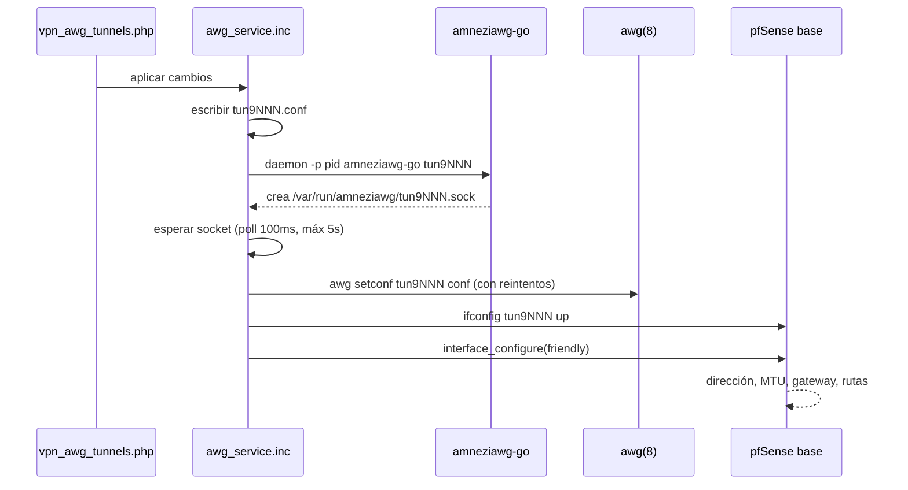

# pfSense-pkg-AmneziaWG — Arquitectura

Documento de diseño para un paquete de pfSense que agrega **VPN → AmneziaWG**,
con gestión de túneles y peers desde la GUI, al nivel del paquete oficial de
WireGuard.

Estado: diseño cerrado, sin implementar. Las decisiones de acá salen de un
spike hecho contra pfSense 2.9.0-BETA el 13-08-2026 y del estudio de tres
implementaciones existentes.

---

## 1. Qué es AmneziaWG y qué cambia

AmneziaWG es un fork de WireGuard para evadir DPI. La criptografía es la misma;
lo que cambia es la forma de los paquetes en el cable.

WireGuard es trivial de fingerprintear: el handshake initiation siempre mide
148 bytes y arranca con `0x01`, el response siempre 92 bytes con `0x02`. Un DPI
lo detecta y lo descarta sin mirar el contenido. AmneziaWG agrega paquetes
basura, relleno de tamaño variable y headers arbitrarios para romper esa firma.

Para la GUI esto significa **16 campos nuevos, todos a nivel `[Interface]`**.
Ninguno es por peer — verificado en `config.c` de `amneziawg-tools`. La página
de peers no se toca.

---

## 2. Decisión de arquitectura: userspace

Hay dos formas de implementar el data plane. Se eligió userspace.

### Lo que se descartó: módulo de kernel

Existe `net/amnezia-kmod` en los ports de FreeBSD (`if_amn.ko`, v2.0.11,
mantenedor vova@zote.me). Es el driver `if_wg` de FreeBSD con cambios mínimos.
Se probó cargarlo en pfSense 2.9.0-BETA:

```
KLD if_amn.ko: depends on kernel - not available or version mismatch
```

El módulo está compilado para `__FreeBSD_version` **1600019**; el kernel de la
caja es **1600018**. Una versión de diferencia y no carga.

El punto no es esa caja puntual. Los kmod se publican pineados a un
`__FreeBSD_version` exacto, y pfSense corre kernels propios de Netgate que no
van a coincidir con los del builder de FreeBSD salvo por casualidad. Aunque
cargara hoy, se rompería en cada actualización de pfSense. Para un paquete
distribuible habría que publicar un `.ko` por cada build de pfSense.

**Descartado por diseño, no por mala suerte.**

### Lo elegido: `amneziawg-go`

Implementación userspace en Go. Crea una interfaz TUN y habla el protocolo
desde userland. Ventajas decisivas acá:

- No depende de ABI de kernel. Sobrevive a las actualizaciones de pfSense.
- Está empaquetado en los ports de FreeBSD (`amneziawg-go-0.2.16_7`), así que
  arrancar no requirió compilar nada. Hoy igual se compila con parche propio
  —sticky sockets, ver sección 11— desde el mismo tag `v0.2.16`, con
  `tools/build-amneziawg-go.ps1`.
- Arquitectura ya probada en producción sobre pfSense 2.8.1 por
  `qtronixx/pfSense-pkg-amneziawg-client`.

El costo es performance: la criptografía corre en userspace, sin fast path de
kernel. Para un túnel anti-DPI sobre internet el cuello de botella es el enlace
WAN, no el CPU.

---

## 3. Componentes y procedencia

| Componente | De dónde sale | Licencia |
|---|---|---|
| `amneziawg-go` | paquete oficial FreeBSD, por ABI | MIT |
| `awg` / `awg-quick` | `amnezia-tools`, paquete oficial FreeBSD | GPLv2 |
| Modelo de servidor, peers, GUI | fork de `pfSense-pkg-WireGuard` | Apache 2.0 |
| Plomería del proceso userspace | `qtronixx/pfSense-pkg-amneziawg-client` | MIT |
| Spec de validación de los 16 campos | `MrTheory/os-amneziawg` (OPNsense) | — |
| Generador de configs de cliente | `wgeasy`, propio | — |

Sobre GPLv2: si se redistribuye el binario `awg` dentro del `.pkg`, hay que
ofrecer el código fuente. `amneziawg-go` es MIT, sin fricción.

---

## 4. Estructura del paquete

Espejo de `pfSense-pkg-WireGuard`, con el prefijo `awg` en lugar de `wg`.

```
/usr/local/pkg/amneziawg.xml                    registro de menú y servicio
/usr/local/pkg/amneziawg/
    classes/awgconfig.class.php                 modelo de configuración
    includes/awg.inc                            entrada, resync
            awg_api.inc                         creación/destrucción de interfaz
            awg_globals.inc                     constantes, rutas, defaults
            awg_guiconfig.inc                   helpers de GUI
            awg_install.inc                     hooks de install/deinstall
            awg_service.inc                     supervisor de procesos go
            awg_validate.inc                    validación de los 16 campos
/usr/local/www/awg/
    vpn_awg_tunnels.php                         lista de túneles
    vpn_awg_tunnels_edit.php                    edición + sección Obfuscation
    vpn_awg_peers.php                           lista de peers
    vpn_awg_peers_edit.php                      edición de peer
    vpn_awg_settings.php                        ajustes del paquete
    status_amneziawg.php                        estado
/usr/local/bin/amneziawg-go                     binario, por ABI
/usr/local/bin/awg                              binario, por ABI
/usr/local/etc/rc.d/amneziawgd                  rc script
/etc/inc/priv/amneziawg.priv.inc                privilegios
/usr/local/www/widgets/                         widget de dashboard
```

El menú se registra con cinco líneas en el XML; pfSense lo levanta solo:

```xml
<menu>
    <name>AmneziaWG</name>
    <section>VPN</section>
    <url>/awg/vpn_awg_tunnels.php</url>
</menu>
```

---

## 5. Nombres de interfaz

**`tun9000`–`tun9999`.**

Esta es la decisión menos obvia del diseño y la que evita un problema serio.
pfSense reconoce las interfaces `tunN` como asignables en
Interfaces → Assignments sin necesidad de parchear nada de la base. Un nombre
inventado tipo `tun_awg0` no aparecería en la lista de asignación.

Es la solución que usa `pfSense-pkg-amneziawg-client`, validada en producción.
El rango alto evita colisionar con túneles de OpenVPN.

---

## 6. Ciclo de vida de un túnel



Tres detalles que salieron de leer `awg_up()` y que no son obvios:

1. **`daemon(8)` sin el flag `-f`.** `-f` redirige stdio del hijo a `/dev/null`
   — no significa "forkear". Con `-f` se pierden todos los logs y crashes de
   `amneziawg-go`. El autor del paquete de referencia lo documentó después de
   perder tiempo debuggeando con archivos de log vacíos.

2. **Hay que esperar el socket UAPI antes de `setconf`.** El proceso Go tarda
   en crear `/var/run/amneziawg/tun9NNN.sock`. Sin la espera, `setconf` falla.

3. **Dirección, MTU y gateway los pone pfSense, no el paquete.** Se llama a
   `interface_configure()` con el nombre amigable de la interfaz asignada.
   Única fuente de verdad, y así el resto del firewall (reglas, NAT, DNS) ve el
   túnel como cualquier otra interfaz.

`awg` habla con el proceso userspace y no con el kernel: `ipc.c` chequea
`userspace_has_wireguard_interface()` antes de caer al camino de kernel, y
`amneziawg-go` y `amneziawg-tools` coinciden en `/var/run/amneziawg`.

---

## 7. Modelo de datos: los 16 campos

Todos a nivel `[Interface]`. Rangos tomados del `Instance.xml` de OPNsense.

| Campo | Tipo | Rango | Significado |
|---|---|---|---|
| `Jc` | int | 1–128 | cantidad de paquetes basura antes del handshake |
| `Jmin` | int | 1–1280 | tamaño mínimo de esos paquetes |
| `Jmax` | int | 1–1280 | tamaño máximo |
| `S1` | int | 0–1280 | relleno del paquete init |
| `S2` | int | 0–1280 | relleno del response |
| `S3` | int | 0–1280 | relleno del cookie reply — **AWG 2.0** |
| `S4` | int | 0–1280 | relleno del transport — **AWG 2.0** |
| `H1`–`H4` | **texto** | `/^\d{1,10}(-\d{1,10})?$/` | headers mágicos, 5–4294967295 |
| `I1`–`I5` | texto | libre | paquetes junk con contenido propio — **AWG 2.0** |

**Trampa: `H1`–`H4` no son enteros.** Aceptan rangos con guión
(`787134324-1593815189`). Si se modelan como `Form_Input` numérico se rompe
silenciosamente con configs reales.

**Dos restricciones más, leídas de `amneziawg-go` en la fase 3.** Ninguna de
las dos está en el modelo de OPNsense, y las dos dejan el túnel sin levantar
porque el backend rechaza el `setconf` **entero**, no el campo:

- **Los cuatro headers no se pueden solapar.** `mergeWithDevice()`
  (`device/uapi.go`) los compara de a pares con `UintRange.Overlap()` y corta
  con `headers must not overlap`. Como `H` puede ser un rango, "solaparse" es
  intersección de intervalos, no igualdad.

- **De ahí sale el mínimo de 5**, y no es cosmético. El device arranca con los
  headers en los tipos de mensaje estándar de WireGuard (1 init, 2 response,
  3 cookie, 4 transport) y un `H` que no se setea **conserva el suyo**. Así que
  cualquier valor entre 1 y 4 choca con el default de los que quedaron vacíos.

Hay una tercera que **no** se valida: `S1`–`S4` deben ser ≥ 12
(`HeaderCipherNonceSize`) *solo* si hay clave de header protection, que este
paquete no expone. Validarla rechazaría `S1 = 0`, que es válido y es el mínimo
documentado.

**Versionado del protocolo.** `S3`, `S4`, los rangos en `H` y los `I1`–`I5` son
AWG 2.0. Contra un backend 1.x esos campos no deben escribirse en el `.conf`.
La GUI tiene que saber contra qué versión de backend corre.

Ejemplo de `.conf` generado:

```ini
[Interface]
PrivateKey = ...
ListenPort = 51820
Jc = 5
Jmin = 10
Jmax = 50
S1 = 34
S2 = 134
H1 = 787134324-1593815189

[Peer]
PublicKey = ...
AllowedIPs = 10.8.1.14/32
```

---

## 8. Convivencia con pfSense-pkg-WireGuard

El objetivo es que ambos paquetes puedan estar instalados a la vez. Puntos de
colisión a revisar:

| Recurso | WireGuard | AmneziaWG |
|---|---|---|
| Socket UAPI | `/var/run/wireguard` | `/var/run/amneziawg` ✓ ya distinto |
| Prefijo de interfaz | `tun_wg` | `tun9NNN` ✓ ya distinto |
| Interface group | `WireGuard` | `AmneziaWG` |
| Alias de puertos | `WireGuardListenPorts` | `AmneziaWGListenPorts` |
| ACL de Unbound | `WireGuard` | `AmneziaWG` |
| Servicio | `wireguardd` | `amneziawgd` |
| Rama de config XML | `installedpackages/wireguard` | `installedpackages/amneziawg` |
| Entradas de menú | VPN/Status → WireGuard | VPN/Status → AmneziaWG |

Los dos primeros ya están resueltos por las decisiones de arquitectura. El
resto es renombrado disciplinado en `awg_globals.inc`, donde toda la identidad
del paquete está centralizada.

### El espacio de nombres de PHP también es un recurso compartido

Falta uno en esa tabla, y no es de runtime: **las funciones, clases y
constantes globales de PHP**. Hay páginas que cargan los dos paquetes en el
mismo proceso —el dashboard, donde conviven los widgets— y ahí el segundo en
cargarse aborta con `Cannot redeclare function`. El usuario no puede hacer nada
salvo desinstalar uno.

El renombrado del fork cubre todo lo que tiene `wg` en el nombre. Lo que se
escapa son los helpers de nombre genérico: `array_get_value()`,
`array_set_value()` y `array_unset_value()` venían así del paquete de WireGuard
y rompían el dashboard. Ahora llevan prefijo `awg_`.

La regla es que **todo símbolo global que declare este paquete lleve su
prefijo**, y se verifica con `tools/check-collisions.sh`, que compara `src/`
contra el paquete oficial en `reference/`. Ojo al buscar a mano: las funciones
que devuelven por referencia se declaran `function &nombre`, y olvidarse del
`&` esconde justamente la que rompía.

---

## 9. Build y distribución

**Un `.pkg` por ABI**, porque los binarios embebidos no son intercambiables. Se
compila **uno solo**:

| pfSense | FreeBSD | ABI |
|---|---|---|
| 2.9.0-BETA | 16.0-CURRENT | `FreeBSD:16:amd64` |

2.8.1 / FreeBSD 15 quedó fuera del alcance el 14-08-2026. No hay una 2.8.1
donde probar, y sostener un ABI sin poder verificarlo es publicar algo que nadie
comprobó. El `amneziawg-go` propio es Go puro sin CGO, así que el día que haga
falta ese ABI el mismo binario sirve; lo que faltaría es probarlo.

El `make-pkg.ps1` necesita un paso previo que resuelva y descargue los binarios
del ABI correspondiente. **No se puede adivinar el nombre de archivo**: el repo
publica bajo `All/Hashed/` con sufijo de hash, y los kmod además llevan la
versión de FreeBSD embebida:

```
All/Hashed/amneziawg-go-0.2.16_7~2$fecr5ea7.pkg
```

La única fuente confiable es el catálogo del repo. Tampoco sirve listar `/All/`
— `pkg.freebsd.org` responde `Forbidden`, no hay autoindex.

```sh
fetch -qo - https://pkg.freebsd.org/${ABI}/latest/packagesite.pkg \
  | tar -xOf - packagesite.yaml \
  | grep '"name":"amneziawg-go",' \
  | grep -oE '"repopath":"[^"]*"'
```

---

## 10. Orden de implementación

Cada fase deja algo verificable. No se pasa a la siguiente sin que la anterior
funcione en el firewall.

**Fase 1 — Data plane a mano. ✅ Validada el 13-08-2026.**
`spike/fase1-bringup.sh` levanta dos túneles en el mismo firewall hablándose
por loopback, sin depender de un servidor externo. Resultado sobre pfSense
2.9.0-BETA:

| | |
|---|---|
| Socket UAPI | arriba en 100 ms |
| `awg setconf` con ofuscación | aceptado |
| Handshake | 1 segundo |
| Tráfico por el túnel | ping 0,054 ms de media, 0 % pérdida |
| Backend | AWG **2.0** — acepta `S3`, `S4`, `I1` |

Tres hallazgos que cambian el diseño y están recogidos abajo: `awg show`
devuelve los parámetros de ofuscación, `awg --version` no sirve para detectar
la versión del protocolo, y matar el proceso destruye la interfaz solo.

**Fase 2 — Esqueleto del paquete.** Fork de `wireguard-nativo` con el
renombrado completo. Que instale, aparezca en el menú, y no rompa nada. Sin
funcionalidad de ofuscación todavía.

**Fase 3 — Los 16 campos.** Sección Obfuscation en `vpn_awg_tunnels_edit.php`,
validadores en `awg_validate.inc`, serialización al `.conf`. Acá entra la
trampa de `H1`–`H4` como texto.

**Fase 4 — Supervisión.** `awg_service.inc` como supervisor de N procesos go:
arranque al boot, parada ordenada, reinicio de un túnel sin tocar los otros.

**Fase 5 — Watchdog. ✅ Terminada el 13-08-2026.** Detección de túnel caído y
relevantamiento, por cron. Ni el paquete oficial de WireGuard ni el de
referencia lo tienen; el plugin de OPNsense sí, y se le robaron cuatro ideas:
flag de habilitado, no revivir lo que se bajó a propósito, recuperación
granular, y guarda contra loops de reinicio.

Dos de esas salieron distintas acá. OPNsense marca "parado a propósito" con
flag files (`amneziawg_stopped.flag`); en pfSense eso ya son dos cosas que
viven en la configuración —el servicio parado y el túnel en `enabled=no`— así
que no hacen falta archivos. Y la guarda de OPNsense es un chequeo del módulo
de kernel, que acá no aplica: se reemplazó por backoff exponencial por túnel,
de 60 s a 1 h, que se limpia solo en cuanto el túnel levanta.

El watchdog corre y termina; no es un proceso más que después habría que
vigilar. Toma un lock, porque levantar un túnel puede tardar 5 s esperando el
socket y con varios caídos una corrida se pasa del intervalo del cron.

### La trampa que dejó esta fase: `$awgg` sin declarar

`awg_deinstall()` llamaba `awg_globals()` y después leía `$awgg['watchdog_cmd']`
**sin `global $awgg;`**. En PHP eso no es la global: es una local vacía. Sin
error ni warning útil.

El valor nulo llegó a `install_cron_job($command, false)`, que busca la entrada
con `strstr($item['command'], $command)`. Un needle vacío matchea, así que en
vez de no hacer nada **borró el primer cron del sistema** — se llevó
`/usr/sbin/newsyslog` de un firewall de verdad, y la rotación de logs con él.

Dos defensas, porque una sola no alcanza:

- `tools/check-globals.sh` busca la clase entera: cualquier función que use
  `$awgg` sin declararlo. Llamar `awg_globals()` no alcanza y es justo lo que
  engaña, porque puebla la global pero no el scope local.
- Las funciones que tocan cron se niegan a hacerlo con el comando vacío. Ahí el
  argumento no es de estilo: con `$active` en false, un comando vacío no es
  inocuo sino destructivo.

**Fase 6 — Configs de cliente. ✅ Terminada el 14-08-2026.** Generación de
configs de cliente con QR, zip y mail, incluyendo los parámetros de ofuscación.
Es la pieza que ninguna de las referencias tiene y la que hace usable el modo
servidor. Va dentro de la página de peers del propio paquete: wgeasy tiene que
atornillarse por afuera porque no puede tocar el paquete oficial de WireGuard,
acá la página de peer es propia.

Verificada con 174 tests locales y 61 sobre el firewall.

### La trampa que dejó esta fase: el mailer que no está

El envío por mail se escribió primero sobre **PHPMailer**, que es lo que usa
wgeasy y lo único de los dos caminos que sabe adjuntar un archivo. Antes de dar
la fase por terminada se corrió `spike/verify-mail.php` sobre el firewall, y el
primer test falló: **PHPMailer no existe en pfSense**. No está la clase, no está
el archivo, no está en ningún lado del sistema. Lo que pfSense trae es **PEAR
Mail** (`/usr/local/share/pear`), que es lo que usa su propio
`send_smtp_message()`.

Lo que hace grave al hallazgo es cómo se manifiesta: no hay error. El código
tiene un camino de respaldo, así que el mail sale igual — con el archivo pegado
en el cuerpo del mensaje en vez de adjunto. Todo "funciona", y la única señal de
que el diseño no se está cumpliendo es que el adjunto nunca aparece.

Por eso el adjunto se arma ahora construyendo el MIME a mano sobre PEAR Mail
(`awg_mail_multipart()`), y el camino de PHPMailer se borró en vez de dejarlo
como primera opción: un camino que no puede correr no es un respaldo, es código
muerto que hace creer que hay dos opciones. El test que quedó en la sonda está
invertido a propósito —*"PHPMailer sigue sin estar"*— para que se note si alguna
versión futura lo agrega.

La misma sonda dejó al descubierto tres claves de configuración leídas mal, las
tres heredadas de wgeasy, y las tres con el mismo patrón: leer la clave que no es
no da error, da una funcionalidad silenciosamente degradada.

| se leía | lo que hay de verdad | consecuencia |
|---|---|---|
| `authentication_mech` | `authentication_mechanism` | se manda sin autenticar |
| `isset(ssl_validate)` | `sslvalidate` = `enabled`/`disabled` | nunca se valida el certificado |
| `tls` | no existe; la página solo ofrece SSL | rama muerta |

Y una cuarta, en el camino de respaldo: `send_smtp_message()` devuelve `null`
cuando salió bien y **la cadena del error** cuando falló. El `!== false` con el
que se lo evaluaba da verdadero para las dos, así que un envío fallido se
informaba como éxito.

Los nombres salen de `/usr/local/pfSense/include/www/system_advanced_notifications.inc`,
que es lo que las escribe. Vale como método general: cuando se lee configuración
de otro subsistema, la fuente de verdad es el código que la **escribe**, no el
que la lee.

---

## 11. Riesgos abiertos

### Resuelto: multi-WAN, el túnel solo andaba sobre la WAN del default gateway

> **Arreglado el 14-08-2026** portando sticky sockets a FreeBSD en
> `amneziawg-go` — el TODO de upstream. El detalle del port, sus mediciones y
> sus tests están en [plan-sticky-freebsd.md](plan-sticky-freebsd.md); el
> parche en `patches/amneziawg-go/`. Verificado: el cliente conecta por las dos
> WAN, en pf queda un solo estado, y las respuestas salen por la interfaz
> correcta. **Sin reglas de firewall agregadas**, que era la condición.
>
> Se deja el diagnóstico entero abajo porque el síntoma es difícil de leer y
> puede volver con otro binario, u otro BSD donde el port no esté.

Medido el 14-08-2026 sobre el firewall, que tiene dos WAN: `pppoe0`
(198.51.100.1, a donde apunta el dyndns) e `igb0` (192.168.0.117, **que tiene
el default gateway**). Un cliente que discaba a la PPPoE se quedaba en
"connecting" para siempre.

La captura en `pppoe0` mostró solo tráfico entrante: las iniciaciones llegaban
enteras y correctas —los 4 paquetes basura de `Jc` y la iniciación de 178 bytes
con el relleno de `S1`—, `awg show` contaba 30 respuestas enviadas, y ninguna
aparecía en el cable. El estado de pf dijo por dónde se iban:

```
all  udp 198.51.100.1:51822 <- 203.0.113.9:3197    entra por PPPoE
igb0 udp 192.168.0.117:51822  -> 203.0.113.9:3197    sale por la OTRA WAN
```

La respuesta salía por el default gateway, con la dirección de origen de la otra
interfaz. El cliente le habló a `198.51.100.1` y descarta cualquier cosa que
no venga de ahí.

**La causa es `amneziawg-go`, y la hereda de `wireguard-go`.** Responder desde
la misma dirección por la que llegó el paquete se llama *sticky sockets*, y en
`conn/sticky_default.go` —archivo con copyright de WireGuard LLC, no de
Amnezia— está sin implementar para todo lo que no sea Linux:

```go
//go:build !linux || android
const StdNetSupportsStickySockets = false

// TODO: macOS, FreeBSD and other BSDs likely do support the sticky sockets
// {get,set}srcControl feature set, but use alternatively named flags and
// need ports and require testing.
```

El contraste que lo prueba, en la misma caja y con el mismo teléfono: el
paquete oficial de WireGuard **sí** hace handshake por la PPPoE. No es
WireGuard contra AmneziaWG: es `if_wg.ko` **en el kernel** contra
`amneziawg-go` **en userspace**. Una implementación de kernel ya está adentro
de la pila de red y sabe por dónde le llegó el paquete; un proceso de userspace
tiene un socket UDP como cualquier otro y tiene que pedir esa información
explícitamente. Corriendo `wireguard-go` en vez del módulo, WireGuard fallaría
igual. La ofuscación no interviene: la falla es en la capa de sockets, debajo
del protocolo.

Era un costo de la decisión de la sección 2 —userspace porque `if_amn.ko` no
carga—, al lado del 2,5x de CPU. **Se eligió la cuarta salida**, que es la única
que no le traslada el problema al usuario: portar sticky sockets a FreeBSD. Las
otras tres se descartaron y conviene saber por qué, porque cada una parece
razonable de a una:

| | por qué no |
|---|---|
| Default gateway en la WAN del túnel | cambia por dónde sale todo el tráfico del firewall para arreglar una VPN |
| Publicar el túnel por la WAN del default gateway | obliga a un port forward aguas arriba y a elegir WAN por el bug, no por la red |
| Regla flotante `route-to` + NAT de salida con static-port | anda, pero le pide a cada usuario con doble WAN dos reglas que no tienen que ver con su red |

Las tres son configuración que el usuario tendría que descubrir a partir de un
síntoma que no deja ni una línea de log. Un paquete que se publica no puede
pedir eso.

- **Estabilidad de los procesos go a largo plazo.** El watchdog de la fase 5
  existe justamente porque el plugin de OPNsense consideró necesario tenerlo.
- **Duplicación de mantenimiento con wgeasy.** Dos árboles de código con mucha
  lógica común. La fase 6 dio la primera evidencia concreta de lo que cuesta: el
  envío por mail se portó de wgeasy y traía cuatro bugs —tres claves de
  configuración leídas mal y un valor de retorno interpretado al revés—, más un
  mailer que no existe en pfSense. Los bugs siguen **vivos en wgeasy**, que es un
  paquete publicado: ahí el mail funciona contra un servidor sin autenticación y
  falla en silencio contra uno con ella.

  Extraer lo compartido no arreglaría esto por sí solo —el código común habría
  llevado los mismos bugs a los dos lados—, y lo que sí los encontró fue correr
  una sonda contra el sistema real. Pero deja claro que un arreglo acá no llega
  solo al otro repo, y que hay que ir a aplicarlo a mano.

### Resuelto: el throughput

Medido el 14-08-2026 con `spike/throughput.sh` sobre el firewall de
2.9.0-BETA (i5-3570, 4 núcleos). El detalle entero, incluido el porqué de cada
decisión del método, está en [medicion-throughput.md](medicion-throughput.md).
Mediana de 3 ventanas de 10 s; el caudal es payload puro.

| escenario | Mbps | pps | cores | Mbps/core |
|---|---|---|---|---|
| `wg-kernel` (`if_wg`) | 1483 | 133 155 | 2,38 | 623 |
| `awg-plano` | 828 | 74 310 | 3,40 | 243 |
| `awg-ofuscado` | 835 | 74 985 | 3,41 | 245 |

Tres cosas quedan establecidas:

**El caudal alcanza de sobra.** Esos ~830 Mbps son pagando cifrar *y* descifrar
en la misma caja. Un pfSense contra clientes remotos paga una sola mitad por
paquete: cifrar costó 1,72 cores y descifrar 1,42, o sea ~480 Mbps por core de
cifrado. El techo de paquetes por segundo es ~75 000, y con tráfico de paquetes
chicos ese límite pega antes que el de Mbps.

**La ofuscación no cuesta caudal**: 835 contra 828 Mbps y la misma CPU al
decimal. Cierra con el diseño de AmneziaWG 1.x —`Jc`/`Jmin`/`Jmax` son paquetes
basura *previos* al handshake y `S1`/`S2` es relleno *del* handshake; los datos
van como WireGuard común con otro valor de tipo (`H4`)—. Se paga en el
handshake, no en el tráfico. Importa para la fase 6: los parámetros que se
generen para un cliente no tienen costo de rendimiento.

**Userspace cuesta 2,5x por core** (623 contra 244 Mbps/core). Es el precio de
la decisión de la sección 2 de no usar el módulo de kernel, y ahora está
cuantificado.

Lo que hay que recordar del método, porque el montaje obvio no mide nada: **dos
túneles en la misma caja no se hablan por el túnel**. Con una sola tabla de
ruteo la dirección del otro extremo es local y el kernel manda todo por `lo0`.
Conviene releer con esto en la mano la fase 5 de `spike/fase1-bringup.sh`: aquel
ping entre `10.253.253.1` y `.2` probablemente nunca pasó por el túnel. No
invalida la fase 1 —lo que prueba que la criptografía anda es el handshake, no
el ping— pero ningún harness futuro debería volver a apoyarse en ese camino.

### Resueltos en la fase 1

- **Detección de versión del backend.** `awg --version` **no sirve**: reporta
  `v1.0.20250521` cuando el paquete instalado es `amnezia-tools-1.0.20250903`,
  y `amneziawg-go` dice `0.0.20250522` siendo el paquete `0.2.16_7`. Las
  versiones que reportan los binarios no tienen relación con las del paquete.
  El método confiable es la **sonda empírica**: intentar un `setconf` con
  `S3`/`S4` y ver si lo acepta.

  **Implementado en la fase 3** como `awg_backend_supports_awg2()`, y sale más
  barata de lo previsto: no hace falta ni interfaz ni proceso. `awg(8)` parsea
  el archivo entero *antes* de tocar la interfaz, así que un `setconf` contra
  una interfaz inexistente falla siempre pero falla distinto —
  `Configuration parsing error` si no conoce la clave, `Device not configured`
  si sí—. Y es justo la pregunta que importa: lo que hay que saber es si es
  seguro escribir `S3`/`S4` en el `.conf`. El resultado se cachea en
  `run_path`, que es tmpfs, así que se revalida solo en cada boot.

- **Lectura del estado.** `awg show <if>` devuelve los parámetros de ofuscación
  ya aplicados (`jc`, `jmin`, `jmax`, `s1`, `s2`, `h1`–`h4`), no solo el
  estado del peer. La página de estado puede leerlos de ahí en vez de
  reconstruirlos desde el `.conf`.

- **Destrucción de interfaz.** Matar el proceso `amneziawg-go` destruye la
  interfaz `tun` sola; no hace falta `ifconfig destroy`. Simplifica el
  supervisor de la fase 4.

  **Corregido en la fase 4: eso vale solo para `SIGTERM`.** Medido con un
  experimento controlado sobre el firewall:

  | señal | proceso | socket UAPI | interfaz |
  |---|---|---|---|
  | `SIGTERM` | se va | se va | se va |
  | `SIGKILL` | se va | **queda** | **queda** |

  `amneziawg-go` limpia lo suyo únicamente si lo dejan. Un proceso que se cae
  —que es justo el caso que un supervisor existe para atender— deja el socket
  y la interfaz colgados. De ahí que el estado "corriendo" no se pueda deducir
  de que exista el socket, y que bajar un túnel tenga que limpiar siempre en
  vez de confiar en que el proceso lo hizo.

---

## Referencias

Clonadas en `AmneziaWG/` (ignorada por git, son de terceros):

| Repo | Para qué |
|---|---|
| `amnezia-vpn/amneziawg-go` | data plane userspace |
| `amnezia-vpn/amneziawg-tools` | `awg`, formato de `.conf`, IPC |
| `qtronixx/pfSense-pkg-amneziawg-client` | plomería del proceso, MIT |
| `MrTheory/os-amneziawg` | spec de validación, watchdog |
| `vgrebenschikov/wireguard-amnezia-kmod` | fuente del kmod (no usado) |

Y el paquete oficial de WireGuard en dos versiones, para diffear contra qué
cambia Netgate: `wireguard-nativo/` (0.2.9_6) y `wireguard-nativo-0.2.13/`
(0.2.13_3, del árbol de ports).

Entre esas dos versiones lo único funcional que cambió fue
`platform_booting()` → `is_platform_booting()`, un return code y un máximo de
widget. **El código base a forkear es estable.** El riesgo de compatibilidad
entre 2.8.1 y 2.9.0 no está en el paquete de WireGuard sino en funciones de la
base de pfSense que Netgate renombra; conviene envolverlas con
`function_exists()` si se quiere un solo árbol para las dos versiones.
